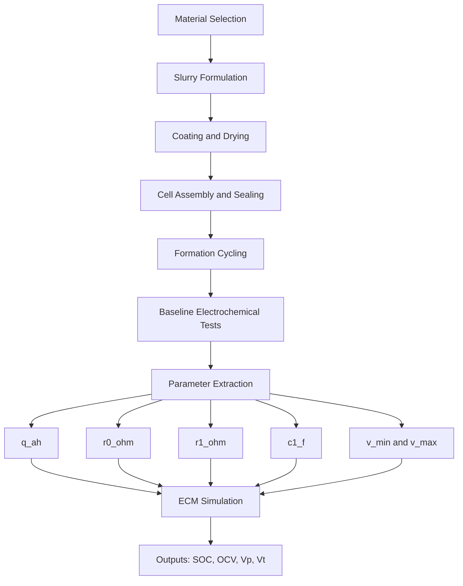

# Architecture Diagram and Experiment Template

## Architecture Diagram

## Clean Documentation Template for Each Experiment

Record these fields for every run:

- Run ID and date
- Cell format and dimensions
- Material lot numbers
- Ratio used (active/conductive/binder)
- Slurry solids percentage
- Coating thickness and drying condition
- Electrolyte quantity used
- Formation protocol
- Capacity and efficiency results
- Extracted ECM parameters
