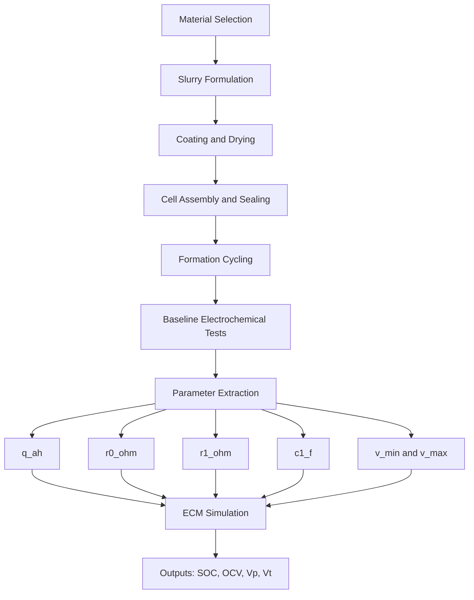

# Architecture Diagram and Experiment Template

## Architecture Diagram



## Clean Documentation Template for Each Experiment

Record these fields for every run:

- Run ID and date
- Cell format and dimensions
- Material lot numbers
- Ratio used (active/conductive/binder)
- Slurry solids percentage
- Coating thickness and drying condition
- Electrolyte quantity used
- Formation protocol
- Capacity and efficiency results
- Extracted ECM parameters

## Sample Filled Run Sheet (Example)

Use this sample format for one experiment entry.

```text
Run ID: SIB-LAB-B0-R01
Date: 2026-04-02
Cell format: Coin cell (trial)
Cell geometry: 16 mm electrode disk
Material lots:
    Active material: AG-ACT-2401
    Conductive additive: CB-031
    Binder: BND-PVDF-010

Ratio (active:conductive:binder): 85:8:7
Total dry solids: 10.0 g
Slurry solids: 35 wt%

Coating:
    Wet thickness target: 120 um
    Drying profile: controlled ramp, then hold
    Calendaring: yes

Electrolyte:
    Wetting mode: incremental addition
    Notes: full separator wetting confirmed visually

Formation protocol:
    Initial low-rate cycles with rest periods
    Sampling interval: fixed for all steps

Measured outputs:
    First-cycle capacity: [enter value]
    Coulombic efficiency: [enter value]
    OCV rest checkpoints: [enter values]
    Pulse response file: [enter filename]

Extracted ECM parameters:
    q_ah: [enter value]
    r0_ohm: [enter value]
    r1_ohm: [enter value]
    c1_f: [enter value]
    v_min: [enter value]
    v_max: [enter value]

Decision:
    Keep / modify ratio for next run
```

## Parameter Handoff Checklist

Before updating the simulation model, verify:

- Capacity value is computed on stabilized cycle data
- IR drop was taken from consistent pulse conditions
- Relaxation fit used clean, non-outlier samples
- Voltage limits were selected from observed safe operation window

For final sign-off and print-ready QA tracking, use:

- [08-validation-checklist.md](08-validation-checklist.md)
