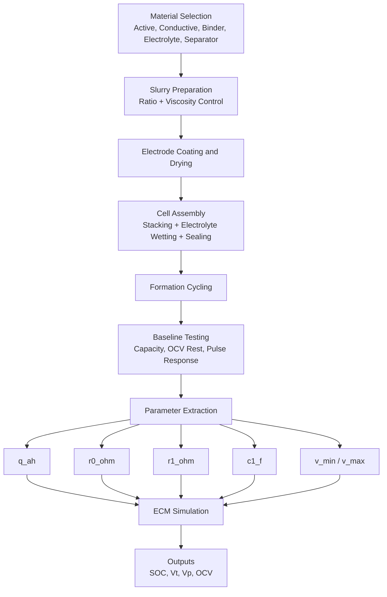

# Silver-Ion Battery Making Guide (Educational Lab-Scale)

## 1. Purpose and Scope

This document provides a clean, step-by-step guide for educational understanding of silver-ion battery making concepts, major chemicals, approximate quantity ranges, and process flow.

This guide is for educational and research planning use only. It is not an industrial manufacturing SOP and not a substitute for certified lab training.

## 2. Safety First (Read Before Any Work)

- Work only in a supervised lab with proper ventilation.
- Use PPE: chemical-resistant gloves, lab coat, safety goggles, and suitable mask/respirator as required by SDS.
- Handle silver salts, alkaline/organic electrolytes, and solvents strictly per SDS and institutional safety rules.
- Keep Class D and appropriate chemical fire response readiness in place.
- Keep moisture-sensitive materials in controlled dry conditions where required.

## 3. Core Concept Used in This Project

This repository uses a reduced-order Equivalent Circuit Model (ECM) for silver-ion cell behavior:

- Open-circuit voltage function: OCV(SOC)
- Ohmic resistance: R0
- Polarization branch: R1 || C1
- State variables: SOC and polarization voltage

This means physical cell-making data is eventually mapped into model parameters:

- Capacity -> q_ah
- Instant voltage drop -> r0_ohm
- Transient relaxation response -> r1_ohm and c1_f
- Operating window -> v_min, v_max

Reference simulation values currently used in code:

- q_ah = 2.0 Ah
- r0_ohm = 0.035 Ohm
- r1_ohm = 0.020 Ohm
- c1_f = 2200.0 F
- v_min = 2.8 V
- v_max = 4.2 V

## 4. Chemicals Used and Their Role

The exact chemistry can vary by silver-ion system design. At a practical educational level, components are typically grouped as follows:

1. Cathode active material (silver-based or silver-containing host)
Role: stores/releases ions during cycling.

2. Conductive additive (example category: carbon black family)
Role: improves electrode electronic conductivity.

3. Polymeric binder (example category: PVDF/CMC/SBR depending on solvent system)
Role: binds particles and adheres coating to current collector.

4. Solvent system (example category: NMP for PVDF systems or water-based systems)
Role: creates coatable slurry viscosity.

5. Current collector foils
Role: electron pathway for cathode and anode.

6. Separator
Role: ion transport path while preventing short circuit.

7. Electrolyte salt + solvent package (chemistry-dependent)
Role: ionic conduction medium between electrodes.

8. Optional additives
Role: interface stabilization, cycle efficiency improvement, or safety enhancement.

## 5. Approximate Quantity Guidance (Lab-Scale, Non-Production)

Use approximate ratio bands for trial-level educational formulation only.

### 5.1 Example cathode slurry ratio (by active-layer solid mass)

- Active material: 80-90 wt%
- Conductive additive: 5-10 wt%
- Binder: 3-8 wt%

Typical starter target often used in many lab workflows:

- 85 : 8 : 7 (Active : Conductive : Binder)

### 5.2 Small-batch solid loading example

If total dry solids = 10 g:

- Active material: about 8.5 g
- Conductive additive: about 0.8 g
- Binder solids: about 0.7 g

### 5.3 Slurry solvent amount (process-dependent)

- Add solvent gradually to reach coatable viscosity.
- Practical range is often near 25-45 wt% solids in slurry, depending on coating method.

### 5.4 Electrolyte wetting amount

- Use only enough to fully wet separator and porous electrodes.
- Typical lab coin/pouch studies may start in a low-mL or sub-mL range depending on cell size and stack thickness.

Important: electrolyte composition and exact volumes must be finalized through chemistry-specific validation and safety review.

## 6. Step-by-Step Making Process

1. Define cell format and target specs
- Decide format (coin/pouch/lab prototype), target capacity, voltage window, and cycle objective.
- Record acceptance criteria before mixing.

2. Prepare dry materials
- Dry active material, conductive additive, and separator as required by material specs.
- Verify moisture limits where chemistry requires dry-room or glovebox handling.

3. Prepare binder solution or binder phase
- Dissolve/disperse binder in compatible solvent system.
- Mix until uniform and free of visible agglomerates.

4. Prepare electrode slurry
- Blend active material + conductive additive.
- Add binder phase and adjust viscosity with solvent.
- Continue mixing until homogeneous and stable for coating.

5. Coat current collector
- Apply slurry to collector with controlled thickness.
- Track wet thickness target and coating uniformity.

6. Dry and densify electrode
- Dry to remove solvent under controlled temperature/time.
- Optional calendaring to reach desired density and porosity balance.

7. Cut and weigh electrodes
- Punch/cut to cell geometry.
- Measure mass loading (mg/cm^2) and thickness for each sample.

8. Assemble cell stack
- Layer electrode/separator/electrode in correct polarity orientation.
- Prevent particle contamination and edge shorting.

9. Add electrolyte and seal
- Add controlled electrolyte amount for complete wetting.
- Seal cell using the appropriate fixture/protocol for selected format.

10. Formation cycling
- Run low-rate initial charge/discharge cycles.
- Rest between steps to stabilize interfacial behavior.

11. Baseline characterization
- Record initial capacity, Coulombic efficiency, and OCV rest values.
- Run one pulse test for transient response extraction.

12. Map to simulation parameters
- Capacity data -> q_ah
- Instant IR drop from pulse -> r0_ohm
- Relaxation curve fit -> r1_ohm and c1_f
- Safe observed voltage limits -> v_min and v_max

## 7. Architecture Diagram (Mermaid)

## 8. Quality Checklist

- Electrode coating uniform and crack-free.
- Mass loading variance within lab tolerance.
- No abnormal leakage after sealing.
- First-cycle efficiency and voltage profile are physically plausible.
- Pulse response is smooth enough for parameter fitting.

## 9. What This Guide Does Not Provide

- Industrial-scale optimization instructions.
- Exact proprietary chemical recipe for a commercial product.
- Hazard-critical concentration/process setpoints.
- Regulatory approval or certification pathway.

## 10. Recommended Documentation Format for Lab Records

For neat and clean documentation, capture each run with:

- Run ID and date
- Cell format and geometry
- Material lot numbers
- Ratio used (active/conductive/binder)
- Solvent and mixing duration
- Coating thickness and drying conditions
- Electrolyte amount added
- Formation protocol
- Measured outputs (capacity, CE, OCV, pulse data)
- Extracted ECM parameters

A consistent log sheet makes model calibration and repeatability much easier.
