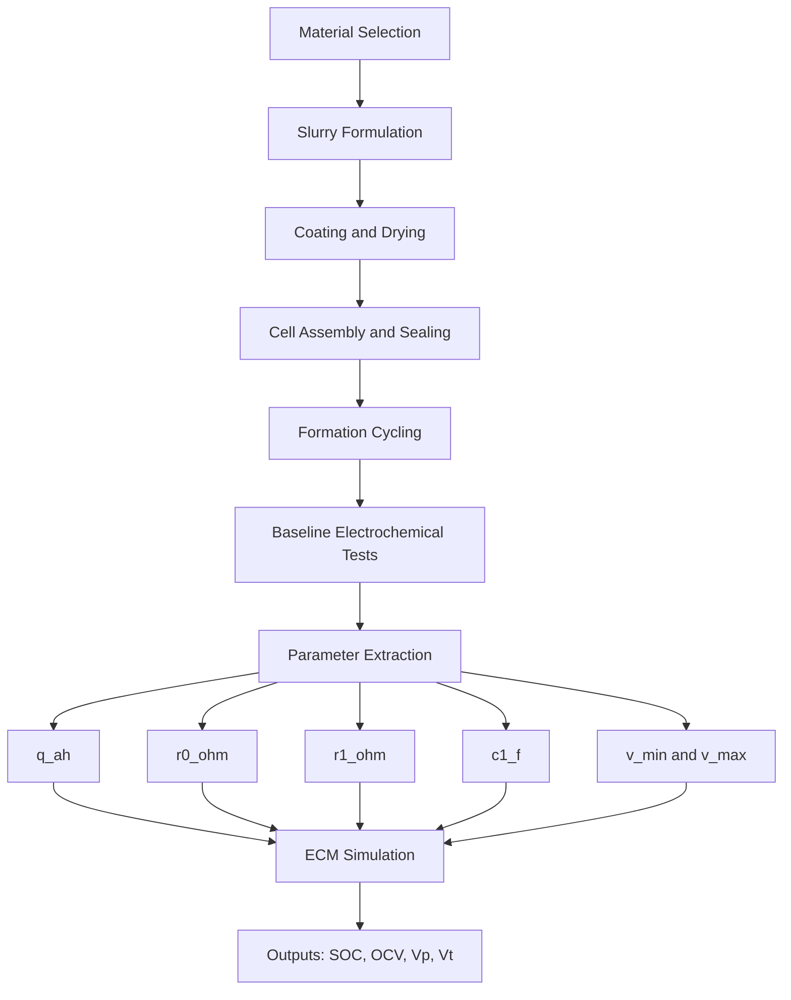

# Silver-Ion Battery Making Guide (Educational, Lab-Scale)

## 1. Purpose

This guide explains:

- What chemical categories are used in a silver-ion battery workflow
- What core concept is used in this repository
- Approximate quantity ranges for trial-scale formulation
- A clean step-by-step making process
- A clear architecture diagram

## 2. Safety Boundary

- Use this for educational planning only.
- Do not treat this as industrial manufacturing instructions.
- Follow SDS, lab SOP, PPE, and institutional safety approval before any chemical work.
- Work only in properly equipped labs with trained supervision.

## 3. Concept Used

The repository uses an Equivalent Circuit Model (ECM):

- OCV(SOC)
- R0 ohmic resistance
- R1 || C1 polarization branch

Physical test results map into model parameters:

- Capacity -> q_ah
- Instant voltage drop -> r0_ohm
- Relaxation transient -> r1_ohm and c1_f
- Safe voltage window -> v_min and v_max

## 4. Chemical Categories and Roles

1. Silver-containing active material
Role: primary electrochemical storage medium.

2. Conductive additive (carbon-class)
Role: improves electron transport in electrode.

3. Binder polymer (PVDF or water-based binder systems)
Role: mechanical cohesion and adhesion to current collector.

4. Solvent system (depends on chosen binder chemistry)
Role: slurry processability and coating viscosity control.

5. Current collectors
Role: current path for electrode reactions.

6. Separator
Role: ion transfer path and short-circuit prevention.

7. Electrolyte salt + solvent package
Role: ion transport across electrodes.

8. Optional additive package
Role: interface stabilization and cycle behavior tuning.

## 5. Approximate Quantity Guidance

### 5.1 Dry solid ratio bands (example cathode mix)

- Active material: 80-90 wt%
- Conductive additive: 5-10 wt%
- Binder: 3-8 wt%

Common starter split in small-lab workflows:

- 85 : 8 : 7 (Active : Conductive : Binder)

### 5.2 Small batch example

For 10 g total dry solids:

- Active material: ~8.5 g
- Conductive additive: ~0.8 g
- Binder solids: ~0.7 g

### 5.3 Slurry solids loading

- Typical trial range: about 25-45 wt% solids
- Tune by coating method and required wet thickness

### 5.4 Electrolyte wetting quantity

- Add only enough for full wetting of separator and porous electrodes.
- Start from low quantity and optimize through validated test protocol.

## 6. Step-by-Step Making Process

1. Define targets
- Choose format (coin/pouch), target capacity, voltage limits, and test objective.

2. Prepare materials
- Dry and precondition materials as required by chemistry and humidity limits.

3. Prepare binder phase
- Dissolve/disperse binder in compatible solvent until uniform.

4. Prepare slurry
- Mix active + conductive phase first, then add binder phase.
- Adjust viscosity for coating stability.

5. Coat electrode
- Coat onto current collector with controlled thickness.

6. Dry and densify
- Dry under controlled temperature/time.
- Apply calendaring if needed for porosity-density balance.

7. Cut and measure
- Cut electrode shape and record thickness plus mass loading.

8. Assemble cell
- Stack electrode/separator/electrode with correct polarity and cleanliness.

9. Add electrolyte and seal
- Wet stack uniformly and seal with selected cell fixture.

10. Formation cycles
- Run low-rate initial cycles with rest phases.

11. Baseline tests
- Capture capacity, first-cycle efficiency, OCV rest, and pulse response.

12. Parameter extraction
- Map measured data to q_ah, r0_ohm, r1_ohm, c1_f, v_min, and v_max.

## 7. Architecture Diagram

## 8. Clean Documentation Template for Each Experiment

Record these fields for every run:

- Run ID and date
- Cell format and dimensions
- Material lot numbers
- Ratio used (active/conductive/binder)
- Slurry solids percentage
- Coating thickness and drying condition
- Electrolyte quantity used
- Formation protocol
- Capacity and efficiency results
- Extracted ECM parameters

## 9. Final Note

Keep formulation and safety decisions chemistry-specific and validated. This guide is intentionally approximate and educational.
