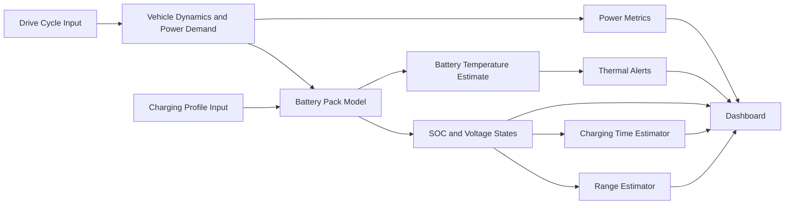

# sim_docs

## EV Simulation with Silver-Ion Battery and Dashboard

## 1. Objective

This document defines a complete plan to simulate an EV using the current silver-ion battery model and display real-time dashboard metrics.

Primary goals:

- Simulate EV energy consumption on drive cycles
- Integrate silver-ion battery behavior into vehicle simulation
- Show dashboard outputs in real time and summary mode
- Estimate charging percentage, charging time, battery power, available range, temperature, and SOH
- Support explicit driving mode, charging mode, and mixed mode with plug-in fast charging

## 2. Scope

In scope:

- Battery model extension from cell level to pack level
- EV longitudinal energy model (power demand from speed profile)
- Charging simulation (AC and DC modes)
- Thermal estimation for battery temperature trend
- Thermal alerts and warning bands
- Dashboard data model and UI metric definitions
- Command-line options aligned with the implementation

Out of scope for first version:

- Full electrochemical PDE model
- Full CFD thermal model
- Hardware-in-the-loop integration
- Production-grade BMS safety controls

## 3. Simulation Architecture



## 4. Core Models

### 4.1 Battery Pack Model

Base model comes from current ECM:

- OCV(SOC)
- R0
- R1 || C1

Pack scaling:

- Series cells: `N_series`
- Parallel strings: `N_parallel`

Approximate scaling rules:

- `V_pack = N_series * V_cell`
- `Q_pack_Ah = N_parallel * Q_cell_Ah`
- `R0_pack = (N_series / N_parallel) * R0_cell`
- Educational scene layout with a Play Area and Control Area
- Grade power
- Acceleration power

Net battery power includes drivetrain and accessory losses.

- `--layout {dashboard, scene}`: choose between the full metric dashboard and the learning scene
- Heat sink to ambient: proportional to `(T_cell - T_amb)`

This yields a practical trend for dashboard monitoring:

- Battery temperature
- Temperature rise rate

For the first implementation, SOH is a simple simulation-side health proxy based on:

This is not a certified aging model. It is a useful dashboard indicator for trend display and future calibration.

These are the exact command-line parameters supported by the implementation.
Use `python/ev_runner.py` or the root wrapper `show_ev_output.py`.


### 9.1 Learning Scene Layout

The `scene` layout uses a simpler educational structure:

- Play Area: vehicle, charger, battery pack, road, thermal indicator, and visible power-flow arrows
- Control Area: charge, range, temperature, SOH, and status cards
- Learning Timeline: compact trace view for SOC, power, and temperature

This layout helps non-experts understand the larger simulation without hiding the engineering data.
- `--dt-s`: simulation timestep in seconds
- `--soc0`: initial state of charge
- `--no-charging`: disables the tail-end charge segment in mixed driving mode
- `--charge-power-kw`: fast-charge power used in charging mode
- `--csv`: time-series output file
## 6. Dashboard Metrics Definition

### 6.1 Charging Percentage
- Show both numeric value and progress bar

### 6.2 Charging Time Remaining
- `final_efficiency_km_per_kwh`
- `final_pack_voltage_v`
- `max_regen_power_kw`
- Instantaneous battery power (kW)
- Positive for discharge, negative for charging
- Moving average over recent window for stability

### 6.4 Available Range

Two estimators should be shown:

- Instant estimator using recent Wh per km
- Smoothed estimator using longer averaging window

Range formula concept:

- `range_km = usable_energy_kWh / consumption_kWh_per_km`

### 6.5 Battery Temperature

Display metrics:

- Current battery temperature (C)
- Thermal status: Normal, Warm, Hot
- Predicted time to warning threshold when rising

Learning scene:

```bash
python show_ev_output.py --layout scene --mode drive --cycle mixed --duration-s 3600 --csv results_ev.csv --summary summary_ev.json
```

### 6.6 State of Health

Display metrics:

- SOH percentage
- SOH trend over time
- Final SOH summary value

### 6.7 Thermal Alerts

Display metrics:

- Thermal status label: Normal, Warm, Hot, Critical
- Alert count during trip
- Max temperature reached

### 6.8 Additional Recommended Metrics

- Pack voltage and current
- Regeneration power
- Energy used this trip (kWh)
- State of health placeholder
- Efficiency (km per kWh)

### 6.9 Status Fields Shown on the Dashboard

- `operation_mode` as `Drive`, `Charge`, or `Mixed`
- `car_status` as `Driving` or `Charging`
- `plugged_in` as `Yes` or `No`
- `initial_time_to_full_hr` as the full-charge estimate when charging

## 7. Input Data Requirements

### 7.1 Drive Cycle Inputs

- Time series: time, speed
- Optional: road grade, ambient temperature, wind factor

### 7.2 Vehicle Parameters

- Vehicle mass
- Frontal area and drag coefficient
- Rolling resistance coefficient
- Wheel radius
- Drivetrain efficiency map (or scalar for V1)

### 7.3 Battery Parameters

- Cell ECM values from current model
- Pack configuration (`N_series`, `N_parallel`)
- Usable SOC window
- Charging power limits
- Thermal coefficients for first-order model

## 8. Simulation Output Schema

At each step, store:

- Time
- Vehicle speed
- Traction power
- Battery current
- Battery voltage
- Battery power
- SOC
- OCV
- Polarization voltage
- Temperature
- Estimated range
- Charging time remaining
- Thermal status code
- Thermal alert flag
- SOH percentage

Suggested output files:

- `results_ev.csv` for time series
- `summary_ev.json` for trip summary and KPIs

Summary file fields now include:

- `cycle`
- `operation_mode`
- `car_status`
- `plugged_in`
- `final_soc_pct`
- `final_range_km`
- `final_temp_c`
- `final_soh_pct`
- `initial_time_to_full_hr`
- `final_time_to_full_hr`
- `max_temperature_c`
- `thermal_alert_count`
- `max_battery_power_kw`
- `min_battery_power_kw`
- `energy_out_kwh`

## 9. Dashboard Design Specification

Panels:

1. Energy Panel:
- SOC percentage
- Battery power (kW)
- Voltage and current

2. Charging Panel:
- Charging state
- Time to 80%
- Time to 100%
- Charging power

3. Range Panel:
- Estimated range (km)
- Consumption trend (Wh per km)

4. Thermal Panel:
- Battery temperature
- Thermal status label
- Alert indicator

5. Trip Panel:
- Distance traveled
- Energy consumed
- Average efficiency

## 10. Implementation Phases

### Phase A: Data and Model Foundation

- Add EV simulation configuration structure
- Add pack scaling wrapper around current battery model
- Implement drive-cycle based power demand

Deliverable:

- Reproducible time-series simulation without dashboard

### Phase B: Charging and Range Estimation

- Implement charging mode simulation (CC then CV approximation)
- Implement range estimators (instant and smoothed)
- Add charging time estimation logic

Deliverable:

- Correct charging percentage and ETA outputs
- Correct charging percentage, ETA, and full-charge estimate outputs

### Phase C: Thermal and Alerts

- Implement first-order thermal model
- Add temperature status bands and alerts

Deliverable:

- Temperature and alert outputs in result files
- Temperature, alert, and SOH outputs in result files

### Phase D: Dashboard Layer

- Implement dashboard data adapter
- Build metric cards and trend charts
- Add real-time playback from simulation timeline (interactive backend)

Deliverable:

- Interactive dashboard with all requested metrics
- Live playback should be available when an interactive Matplotlib backend is active

## 11. Matching Commands

These commands match the current implementation exactly:

Drive scenario:

```bash
python show_ev_output.py --mode drive --cycle mixed --duration-s 3600 --csv results_ev.csv --summary summary_ev.json
```

Fast-charge scenario:

```bash
python show_ev_output.py --mode charge --soc0 0.20 --duration-s 1800 --charge-power-kw 50 --csv results_ev.csv --summary summary_ev.json
```

Animated dashboard:

```bash
python show_ev_output.py --mode charge --soc0 0.20 --duration-s 1800 --animate
```

## 12. Suggested File Plan

Proposed additions in Python path:

- `python/ev_simulation.py`
- `python/ev_dashboard.py`
- `python/drive_cycles.py`
- `python/thermal_model.py`
- `python/range_estimator.py`
- `python/charging_estimator.py`

Suggested documentation additions:

- `docs/sim_docs.md` (this file)
- `docs/ev-dashboard-spec.md` (future detailed UI layout)

## 13. Acceptance Criteria

The first complete version is accepted when:

- EV simulation runs end-to-end for at least one drive cycle
- Dashboard shows SOC, charging time, power, range, and temperature
- Dashboard shows SOC, charging time, power, range, temperature, alerts, and SOH
- Output files include both time series and summary KPIs
- Metrics remain physically consistent (no impossible SOC jumps or negative range)

## 14. Risks and Mitigation

Risk: Range estimate oscillation.
Mitigation: Use dual estimator with smoothing window and confidence band.

Risk: Unrealistic temperature behavior.
Mitigation: Calibrate first-order thermal constants with measured or literature reference ranges.

Risk: Charging time over-optimistic at high SOC.
Mitigation: Include taper factor in CV zone.

## 13. Next Action Plan

1. Implement `python/ev_simulation.py` with pack model + drive cycle
2. Add `results_ev.csv` export
3. Implement charging and range estimators
4. Add thermal estimate and alert flags
5. Build dashboard script and metric cards
6. Validate against sanity scenarios

## 14. Summary

This document is the implementation blueprint for adding EV simulation and dashboard capabilities on top of the existing silver-ion battery model. It defines model boundaries, metrics, architecture, data schema, and phased delivery for practical execution.
